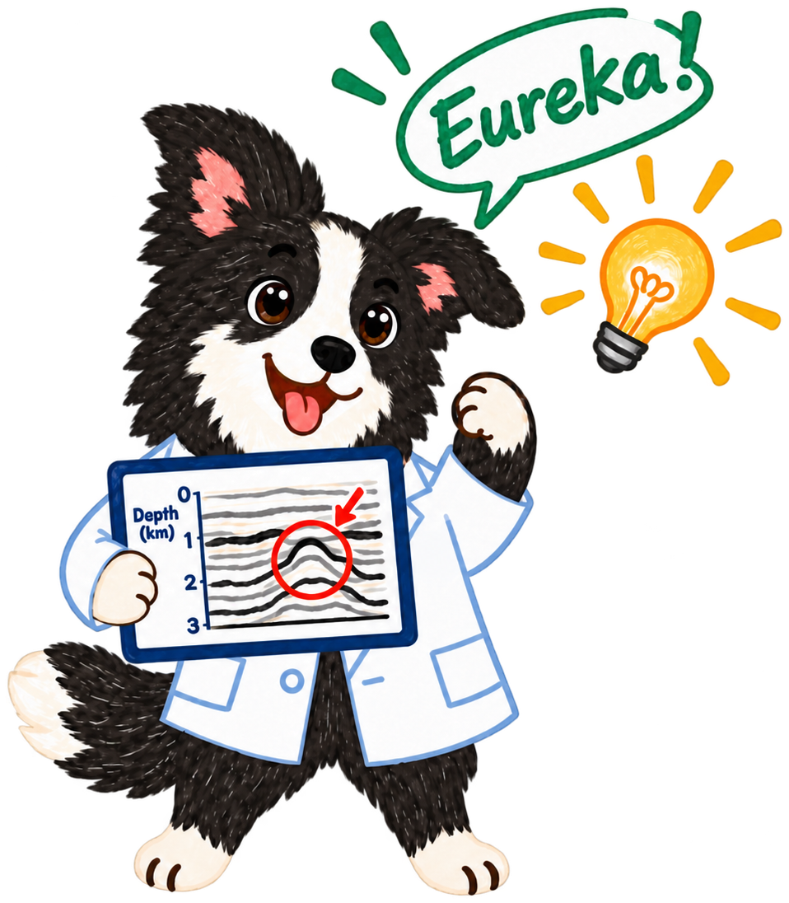

<p align="center">
  
</p>

# EurekaBench: Measuring Agentic Ability to Discover New Scientific Insights

[](https://eurekabench.github.io)
[](https://arxiv.org/abs/2610.00492)

EurekaBench is a cross-domain benchmark that tests AI agents' ability to conduct long-horizon experiments and discover mechanisms that explain observations. We evaluate these mechanisms by the scientific insights that can be derived from them.

Our evaluation framework tests three axes of scientific discovery: agents' ability to follow known scientific constraints, the predictive accuracy of the discovered mechanisms, and whether these mechanisms yield scientific insights or inform future research.

EurekaBench runs on [Harbor](https://harborframework.com). Each problem is a Harbor task under `domains/<domain>/<problem>`.

## Updates

- [2026/10/02] Initial release. More are coming soon.

## Requirements

- A Linux machine with an NVIDIA H100 GPU and the NVIDIA Container Toolkit (`nvidia-container-cli`)
- [Apptainer](https://apptainer.org)
- [uv](https://docs.astral.sh/uv/)
- An API key for the agent and the judge

## Example: running neural-dynamics

`neural-dynamics` asks the agent to explain how the nervous system of *C. elegans* organizes its neural activity into a hierarchy of locomotion commands.

### 1. Check the machine

The simulator of this problem also needs Java.

```bash
nvidia-smi --query-gpu=name --format=csv,noheader
nvidia-container-cli --version
apptainer --version
java -version
uv --version
```

### 2. Install EurekaBench

```bash
uv tool install git+https://github.com/EurekaBench/EurekaBench.git
```

### 3. Build the environment

```bash
eurekabench build neuroscience
```

This builds the sandbox image and the simulators of the neuroscience problems under `/tmp/$USER/eurekabench`. It is done once per domain.

### 4. Run the problem

Here Codex is both the agent and the judge:

```bash
export OPENAI_API_KEY=<YOUR-KEY>
eurekabench run neuroscience neural-dynamics \
    --agent codex \
    --model gpt-5.6-sol \
    --judges codex:gpt-5.6-sol \
    --gpu 0
```

The agent works for up to four hours in the sandbox with web search on, while the source papers and simulator sites are blocked. After that the submission is evaluated on the test data and judged.

### 5. Read the results

The run ends by printing, for each judge and averaged over the judges, the scores for scientific constraints, predictive accuracy and insights, and the gated overall score.

Everything is kept under `jobs/<timestamp>/neural-dynamics__<id>/`:

| Path | Content |
| --- | --- |
| `artifacts/workspace/mechanisms/` | what the agent handed in |
| `agent/` | the agent's trajectory |
| `verifier/reward.json` | the four scores |
| `verifier/score.json` | every verdict of every judge, with its reason |
| `verifier/eval_results.json` | the evaluation on the test data |
| `verifier/judges/` | the judges' prompts, transcripts and notes |

## Question and Issue

Please contact Jiayi Geng at ogeng@cs.cmu.edu for any questions or issues.

## Citation

```bibtex
@misc{geng2026eurekabench,
  title         = {{EurekaBench}: Measuring Agentic Ability to Discover New Scientific Insights},
  author        = {Jiayi Geng and Zhengxuan Wu and Kevin S. Chen and Seungone Kim and Joseph Janssen and Zora Zhiruo Wang and Bhupalee Kalita and Runtian Gao and Aaron Ho and Andrew Oakleigh Nelson and Olexandr Isayev and Francisco Villaescusa-Navarro and Ching-Yao Lai and Howard Chen and Graham Neubig},
  year          = {2026},
  eprint        = {2610.00492},
  archivePrefix = {arXiv},
  primaryClass  = {cs.CL},
  url           = {https://arxiv.org/abs/2610.00492}
}
```
